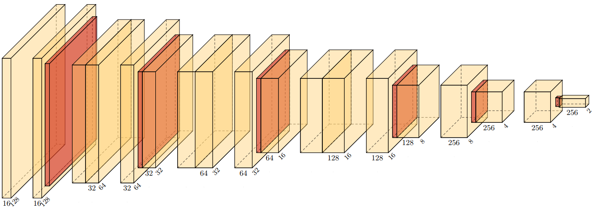

# Animal Image Classification with CNN & Transfer Learning

This project focuses on image classification using the Animals10 dataset. We designed and optimized CNN models from scratch, implemented transfer learning with pre-trained models, and evaluated generalization on new datasets with fewer samples.

## Key Achievements

- **Custom CNN Design**: Designed and trained a compact CNN on the Animals10 dataset, keeping model size under 400,000 parameters.(using multiple tricks like depthwise pointwise structure)

- **Regularization & Optimization**:
  - Controlled overfitting using techniques like dropout and data augmentation.
  - Performed hyperparameter tuning and tested various optimizers.
- **Transfer Learning**:
  - Fine-tuned pre-trained models (ResNet50, EfficientNetB0, MobileNetV2) on new datasets such as:
    - Dog Sentiment Classification
    - Dog, Cat, Horse Classification
